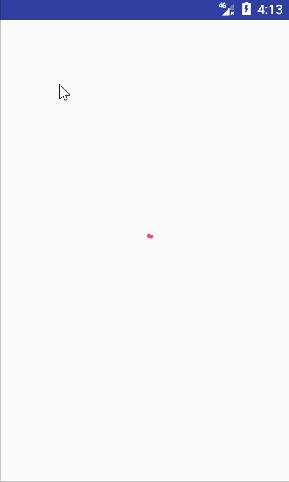

# RefreshLayout
下拉刷新、上拉加载的控件，支持NestedScrolling2特性；使用起来比较方便，支持RecyclerView,ListView,ScrollView,NestedScrollView,WebView

## 使用条件
```
	compileSdkVersion>=26
```

## 使用方法
```xml
<tzy.refreshlayout.RefreshLayout
    android:id="@+id/refresh_layout"
    android:layout_width="match_parent"
    android:layout_height="match_parent">
        <android.support.v7.widget.RecyclerView
            android:id="@+id/recycler_view"
            android:layout_width="match_parent"
            android:layout_height="match_parent" />
</tzy.refreshlayout.RefreshLayout>
```
## 支持：
###  RecyclerView:
```xml
<tzy.refreshlayout.RefreshLayout
    android:id="@+id/refresh_layout"
    android:layout_width="match_parent"
    android:layout_height="match_parent">
        <android.support.v7.widget.RecyclerView
            android:id="@+id/recycler_view"
            android:layout_width="match_parent"
            android:layout_height="match_parent" />
</tzy.refreshlayout.RefreshLayout>
```


###  ListView:
```xml
<tzy.refreshlayout.RefreshLayout
    android:id="@+id/refresh_layout"
    android:layout_width="match_parent"
    android:layout_height="match_parent">
       <ListView
            android:id="@+id/list_view"
            android:layout_width="match_parent"
            android:layout_height="match_parent" />
</tzy.refreshlayout.RefreshLayout>
```


###  NestedScrollView:
```xml
<tzy.refreshlayout.RefreshLayout
    android:id="@+id/refresh_layout"
    android:layout_width="match_parent"
    android:layout_height="match_parent">
       <android.support.v4.widget.NestedScrollView
            android:id="@+id/recycler_view"
            android:layout_width="match_parent"
            android:layout_height="match_parent">
            <LinearLayout
                android:layout_width="match_parent"
                android:layout_height="wrap_content"
                android:orientation="vertical">
                <TextView
                    android:layout_width="match_parent"
                    android:layout_height="wrap_content"
                    android:text="长得帅其实一点用都没有用；除了长得帅点，好像没有什么缺点了。。。。。。。。。。。。。。。。。。。。。。。。。。。。。。。。。。。。。。。。。。。。"
                    android:textSize="60dp" />
            </LinearLayout>
</tzy.refreshlayout.RefreshLayout>
```


###  ScrollView：
```xml
<tzy.refreshlayout.RefreshLayout
    android:id="@+id/refresh_layout"
    android:layout_width="match_parent"
    android:layout_height="match_parent">
        <ScrollView
            android:id="@+id/recycler_view"
            android:layout_width="match_parent"
            android:layout_height="match_parent" >
            <LinearLayout
                android:layout_width="match_parent"
                android:layout_height="wrap_content"
                android:orientation="vertical">

                <TextView
                    android:layout_width="match_parent"
                    android:layout_height="wrap_content"
                    android:text="长得帅其实一点用都没有用；除了长得帅点，好像没有什么缺点了。。。。。。。。。。。。。。。。。。。。。。。。。。。。。。。。。。。。。。。。。。。。"
                    android:textSize="60dp" />

            </LinearLayout>

        </ScrollView>
</tzy.refreshlayout.RefreshLayout>
```


###  WebView:
```xml
<tzy.refreshlayout.RefreshLayout
    android:id="@+id/refresh_layout"
    android:layout_width="match_parent"
    android:layout_height="match_parent">
          <WebView
            android:id="@+id/web_view"
            android:layout_width="match_parent"
            android:layout_height="match_parent" />
</tzy.refreshlayout.RefreshLayout>
```


###  Material Design:
```xml
<android.support.design.widget.CoordinatorLayout xmlns:android="http://schemas.android.com/apk/res/android"
    xmlns:app="http://schemas.android.com/apk/res-auto"
    xmlns:tools="http://schemas.android.com/tools"
    android:layout_width="match_parent"
    android:layout_height="match_parent"
    android:fitsSystemWindows="true">
    <android.support.design.widget.AppBarLayout
        android:id="@+id/app_bar"
        android:layout_width="match_parent"
        android:layout_height="@dimen/app_bar_height"
        android:theme="@style/AppTheme.AppBarOverlay">
        <android.support.design.widget.CollapsingToolbarLayout
            android:id="@+id/toolbar_layout"
            android:layout_width="match_parent"
            android:layout_height="match_parent"
            app:contentScrim="?attr/colorPrimary"
            app:layout_scrollFlags="scroll|exitUntilCollapsed"
            app:toolbarId="@+id/toolbar">
            <android.support.v7.widget.Toolbar
                android:id="@+id/toolbar"
                android:layout_width="match_parent"
                android:layout_height="?attr/actionBarSize"
                app:layout_collapseMode="pin"
                app:popupTheme="@style/AppTheme.PopupOverlay"
                app:title="@string/app_name"
                />
        </android.support.design.widget.CollapsingToolbarLayout>
    </android.support.design.widget.AppBarLayout>
    <LinearLayout
        android:layout_width="match_parent"
        android:layout_height="wrap_content"
        android:orientation="vertical"
        app:layout_behavior="@string/appbar_scrolling_view_behavior">
        <android.support.design.widget.TabLayout
            android:id="@+id/tab_layout"
            android:layout_width="match_parent"
            android:layout_height="wrap_content"/>
        <android.support.v4.view.ViewPager
            android:id="@+id/view_pager"
            android:layout_width="match_parent"
            android:layout_height="match_parent"/>
    </LinearLayout>
    <android.support.design.widget.FloatingActionButton
        android:id="@+id/fab"
        android:layout_width="wrap_content"
        android:layout_height="wrap_content"
        android:layout_margin="@dimen/fab_margin"
        app:layout_anchor="@id/app_bar"
        app:layout_anchorGravity="bottom|end"
        app:srcCompat="@android:drawable/ic_dialog_email" />
</android.support.design.widget.CoordinatorLayout>
```

